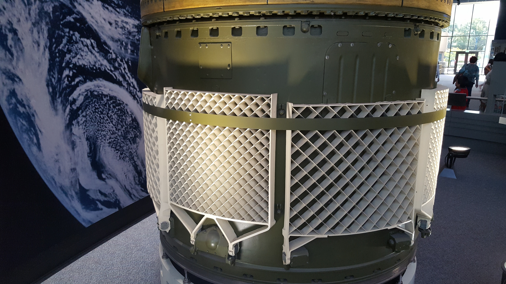
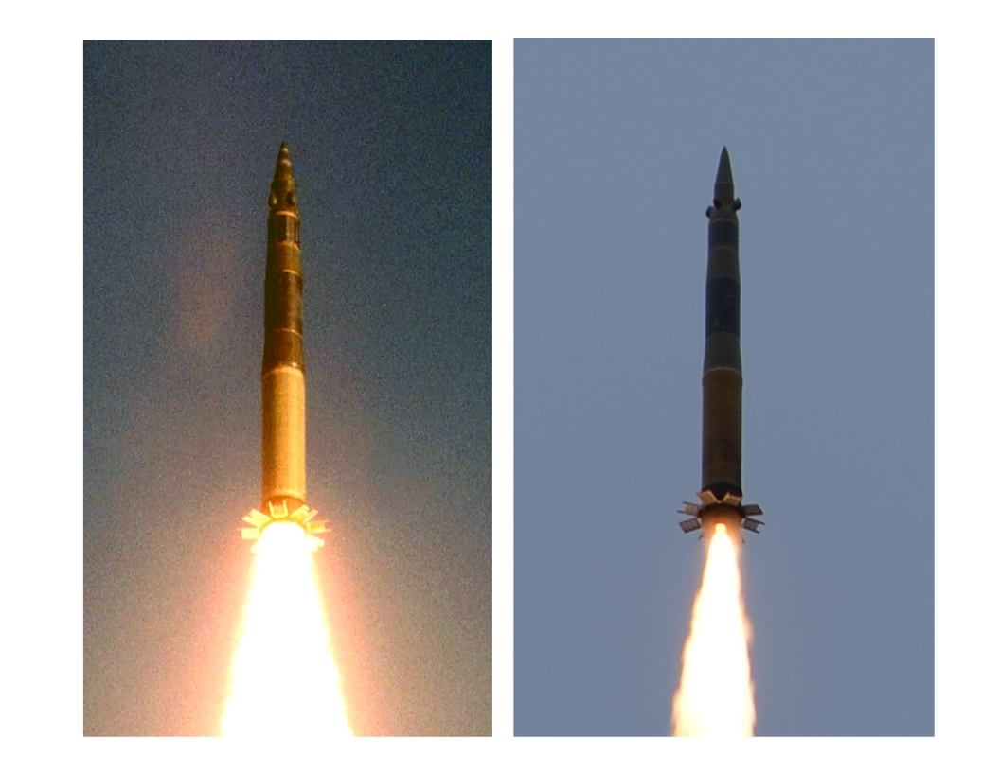

# SS25 model rocket
3D printed rocket components for the amazing Aaron Miles

## Sabots
To stabilize the rocket in the launch tube, upper and lower sabots were used. The full sabots were multi-day prints, so the upper and lower sabots were printed in two pieces which were joined on a cardboard backing.

## Grid fins
The SS25 has two types of grid fins for stabilization. 

Four of each type are needed for the launch. They specification for the STL files is given [here](SS25_grid_fins.pdf)

Side by side comparison of the actual launch and the model launch.

